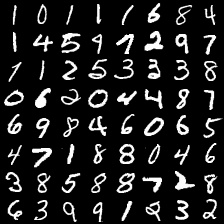
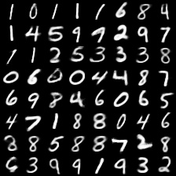
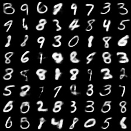

# Variational Auto-Encoder for MNIST
An implementation of Variational Autoencoder as introduced in [Auto-Encoding Variational Bayes](https://arxiv.org/abs/1312.6114)
by Kingma et.al.

<table align='center'>
<tr align='center'>
<td> Input image </td>
<td> Reconstructed image </td>
<td> Generated image </td>
</tr>
<tr>
<td>
<td>
<td>
</tr>
</table>

The results can be reproduced by running the following command:
```
python3 vae_elbo/run_vae_model.py
```

### Requirements
```
python 3.4.3
tensorflow 1.1.0
prettytensor 0.7.4
```

